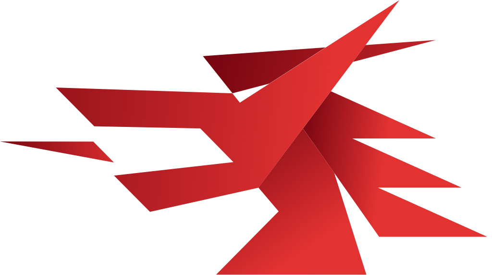

  

<h1 align="center">Vuejs x Wails</h1>
<h3 align="center">Bringing Web Technology to the Desktop with minimum overhead</h3>
 

To start with the workshop, please clone this repository.

After that, open the repository in Visual Studio Code and wait for the "Re-open in Container" prompt.
If the prompt never comes up, hit `CTRL/CMD+SHIFT+P` to bring up the command palette and look for "Dev Containers: Open Folder in Container".

From there, continue in the [README](code/README.md) which is available in the `code` (`app` in docker) directory.
